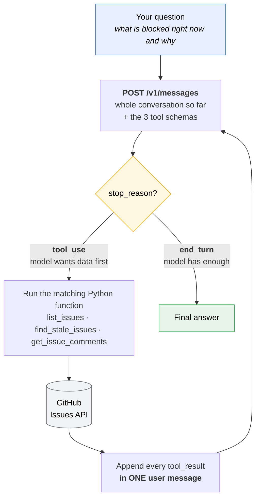

# gh-issue-agent

A small agentic loop: you ask a question in English about a GitHub backlog, and Claude decides which GitHub Issues API calls to make to answer it.

```
$ python agent.py "what's blocked right now and why"
```

There is no keyword matching, no routing table, and no `if "blocked" in question` anywhere in the code. The program's only job is to describe three tools, execute whatever the model asks for, and hand the results back. The decision about *which* tool to call, with *which* arguments, and *how many times*, belongs entirely to the model.

The repository this agent reads is this repository. The issues in the Issues tab are **synthetic seed data** invented for the demo — a fictional billing-reconciliation service — so anyone can clone this and see the agent produce the same answers.

---

## Why this exists

Most "AI-powered" tooling is a single prompt with a single response. An agent is different in one specific way: the model is given the ability to act, observe the result, and decide what to do next. That loop is the entire distinction, and it is about forty lines of Python. This project is those forty lines, with nothing else in the way.

---

## The three tools

| Tool | Backed by | Returns |
|---|---|---|
| `list_issues(state, labels, assignee)` | `GET /repos/{owner}/{repo}/issues` | Number, title, state, labels, assignee, comment count, timestamps, truncated body |
| `find_stale_issues(days, state, labels)` | the same endpoint, plus arithmetic | The same projection, filtered to issues untouched for `days` days, each carrying a computed `stale_days` |
| `get_issue_comments(issue_number)` | `GET /repos/{owner}/{repo}/issues/{n}/comments` | Author, timestamp, and body for each comment |

All three are ordinary Python functions calling the GitHub REST API with `requests`. None of them knows anything about Claude.

`find_stale_issues` is deliberately not a new endpoint — it calls `list_issues` and does the date math locally. It exists because *"what has gone stale"* has no label behind it. Filtering cannot answer it; only computing can. That makes it the tool that most clearly separates an agent from a search box.

**A note on the clock.** `_now()` reads an optional `AGENT_NOW` environment variable and otherwise returns real UTC. Injecting the clock is what makes the date math testable without sleeping — and it is also a demo affordance, because every seed issue in this repo was created within the same minute, so against the real clock they all have identical ages. Run with `AGENT_NOW=2026-11-01` to see staleness ranking do something interesting.

---

## How the agent decides which tool to call

The model never sees the Python. It sees the JSON schemas in `TOOLS` — a name, a description, and a typed parameter list per tool. Those descriptions are the entire basis for its routing decision, which makes them prompt engineering rather than documentation. Three choices in this project do most of the work:

- `list_issues` is described as the broad first step, and its return value is documented as including a **comment count**. That gives the model a cheap signal for deciding whether a thread is worth fetching.
- `get_issue_comments` is described as the tool for finding out *why* — and explicitly as costing one API call per issue. That discourages fetching all twelve threads when three will do.
- `find_stale_issues` states outright that no staleness label exists, so the model knows filtering cannot substitute for it.

The seed data is arranged to make the decision visible. Issue #1 is labeled `blocked`, but its body never says what is blocking it — the answer ("vendor ticket VS-4471") lives only in the comments. So a question like *"what's blocked right now and why"* cannot be answered from `list_issues` alone. Watching the trace, you see the model call `list_issues(labels="blocked")`, get three issues back, and then decide on its own to call `get_issue_comments` on each of them. Nothing in the code told it to do that.

Change the question and the plan changes. Asked *"anything gone stale we should re-check before the v2 shutoff?"*, it opens with `find_stale_issues`, then pulls the threads on the issues that matter — and notices that the Oct 15 escalation deadline written in #5's comments has already passed relative to the staleness it just computed. Two tools and a date comparison, assembled by the model, not by the code.

---

## How the loop works



**The arrow from `BACK` to `API` is the entire idea.** Everything else is a single API call. That one edge — feed the result back and ask again — is what turns a prompt into an agent. The model sees what its own request returned and decides what to do next.

### A real run, turn by turn

This is an actual trace, not an illustration. Nothing in the code chose these calls.

```mermaid
sequenceDiagram
    autonumber
    participant You
    participant Loop as agent.py
    participant Claude
    participant GH as GitHub

    You->>Loop: what is blocked right now and why
    Loop->>Claude: question + 3 tool schemas

    Note over Claude: Picks a filter on its own.<br/>No keyword matching in the code.
    Claude-->>Loop: tool_use — list_issues(labels="blocked")
    Loop->>GH: GET /issues?labels=blocked
    GH-->>Loop: issues 1, 5, 8
    Loop->>Claude: tool_result — 3 issues

    Note over Claude: Titles say WHAT is blocked.<br/>None of them say WHY.<br/>So: go read the threads.
    Claude-->>Loop: 3 tool_use blocks at once — comments on 1, 5, 8
    Loop->>GH: 3 parallel GETs
    GH-->>Loop: comment threads
    Loop->>Claude: 3 tool_results, one message

    Note over Claude: Now it has the reasons.
    Claude-->>Loop: end_turn + answer
    Loop-->>You: blocked on vendor VS-4471, on PLAT-882,<br/>and issue 8 is waiting on issue 10
```

Step 7 is the one worth pointing at in an interview: the model read a list, judged it insufficient, and issued three more calls *in parallel* to fill the gap. That decision lives nowhere in this repository.

Step by step, in `ask()`:

1. **Send.** Post the conversation to `POST /v1/messages` along with the tool schemas. Tools are a parameter on the ordinary Messages endpoint; there is no separate "agent API."
2. **Branch on `stop_reason`.** `"tool_use"` means the response contains one or more `tool_use` blocks and the model is waiting on you. `"end_turn"` means it is finished and the loop exits.
3. **Append the assistant turn verbatim.** `messages.append({"role": "assistant", "content": response.content})` — the whole content list, not just the text. The API is stateless: this list is the only memory the loop has, and a dropped block breaks the next request.
4. **Execute.** Each `tool_use` block carries a `name`, an `input` dict, and an `id`. Dispatch through `TOOL_FUNCTIONS` and capture the output. Tool inputs are parsed JSON — never string-match the serialized form.
5. **Return the results.** Each result is a `tool_result` block whose `tool_use_id` matches the originating call. **All results from one assistant turn go back in a single user message.** Splitting them across several messages trains the model to stop issuing parallel calls.
6. **Repeat.** The model now sees its own request and the real data, and decides whether it has enough to answer.

Two details that matter more than they look:

- **A failed tool returns a result, not an exception.** `run_tool` catches everything and returns the error text with `is_error: True`. The model sees the failure and can retry with different arguments; an uncaught exception would just kill the loop.
- **Tool results are projected down before they are returned.** GitHub sends roughly eighty fields per issue. `list_issues` keeps nine and truncates the body to 600 characters. Every field you keep is re-sent on every subsequent turn of the loop, so the projection is a cost decision, not tidiness.

`max_turns` caps the loop at 10 iterations so a pathological plan cannot bill indefinitely.

---

## Setup

Requires Python 3.10+ and, optionally, the [GitHub CLI](https://cli.github.com/).

```bash
git clone https://github.com/michaeldinhmai/gh-issue-agent-demo.git
cd gh-issue-agent-demo
python -m venv .venv
.venv/Scripts/activate      # macOS/Linux: source .venv/bin/activate
pip install -r requirements.txt
cp .env.example .env
```

Then fill in `.env`:

```
ANTHROPIC_API_KEY=sk-ant-...
GITHUB_TOKEN=                 # optional — falls back to `gh auth token`
GITHUB_REPO=michaeldinhmai/gh-issue-agent-demo
```

`ANTHROPIC_API_KEY` comes from [console.anthropic.com](https://console.anthropic.com/settings/keys). `GITHUB_TOKEN` only needs read access to issues; leave it blank and the agent borrows the token from an authenticated `gh` CLI so no PAT has to be written to disk. `.env` is gitignored.

## Running it

```bash
python agent.py "what's blocked right now and why"
python agent.py "summarize the open bugs"
python agent.py "what has nobody picked up yet"

# staleness needs a future clock - see the note above
AGENT_NOW=2026-11-01 python agent.py "what has gone stale and nobody is chasing?"
```

Each tool call is printed as it happens — `-> tool(args)` for the request, `<- result` for the response — so the plan is visible rather than inferred. Set `AGENT_VERBOSE=0` to silence the trace and print only the answer.

---

## Testing

This project has two halves that fail in completely different ways, so it has two kinds of test.

```bash
pip install -r requirements-dev.txt
pytest                      # 24 tests, no network, no API key, no tokens
python evals/eval_routing.py --runs 3   # spends tokens, needs a live repo
```

**`tests/` — the deterministic half.** Everything except the model's judgement is ordinary code and tests like ordinary code. `tests/test_tools.py` covers the projection (does it drop pull requests, truncate the body, survive a null assignee), the filter forwarding, and the staleness arithmetic — inclusive threshold, no rounding up a partial day, no naive/aware datetime mixing. `tests/test_loop.py` is the more valuable file, because the loop's contract with the API is the thing that breaks silently:

- all `tool_result` blocks from one assistant turn land in a **single** user message
- every `tool_use_id` matches the call it answers
- the assistant turn is appended **whole**, thinking blocks included
- a raising tool becomes an error result, not a crash
- `max_turns` actually caps the loop

Break any of those and the API still returns 200. The model just quietly gets worse — no exception, no failing request, nothing in the logs. That is exactly the failure mode worth a test.

Those tests were checked against deliberate mutations rather than assumed to work: dropping non-text blocks from the assistant turn, splitting tool results across separate user messages, and re-adding `strict: True` to an all-optional schema each produce a failure. The last one is a rule rather than an instance — `test_no_all_optional_schema_declares_strict` walks every tool definition, so a fourth tool added later inherits the guard.

**`evals/` — the non-deterministic half.** Whether the model picks the right tool is not unit-testable. It is a probabilistic decision, and the thing most likely to break it is a *reworded tool description* — a change no unit test would notice, because no code changed.

So the evals assert on the **trace**, never on the prose: given *"what's blocked right now and why"*, did `get_issue_comments` appear at all? (If not, the model answered a "why" question without reading any discussion, which means it invented the reason.) Given a staleness question, did it route to `find_stale_issues`? Did any call come back malformed? Prose assertions would fail on rewrites that are equally correct; trace assertions catch real regressions.

Run them with `--runs N` and read the pass rate, not a single result. One failure on a stochastic system is a prompt to investigate, not proof of a regression.

**What neither would have caught.** The `strict: True` bug that actually shipped here produced malformed tool *arguments* — valid JSON, valid against the schema, semantic garbage. No unit test would have seen it, because no Python behaved incorrectly. Only running the thing against a real API surfaced it. That is the honest limitation: for an agent, integration and behavioural runs are not the optional extra layer on top of unit tests, they are where a whole category of bug lives.

---

## Design notes

**Manual loop, not the SDK tool runner.** The Anthropic Python SDK ships `client.beta.messages.tool_runner`, which drives this loop for you from decorated functions. It is the right choice for production. The loop is written out by hand here because the loop is the thing being demonstrated — and because a hand-written loop avoids the beta dependency and leaves room for per-turn control (approval gates, budget tracking, logging) that the runner exposes only through hooks.

**Model.** `claude-opus-5`. Thinking is on by default on this model, so the model plans before committing to a call; the thinking blocks come back in `response.content` and are echoed to the API unchanged, which is why the assistant turn is appended whole.

**`strict: True` on `get_issue_comments` only — and that asymmetry was earned.** Strict schema validation guarantees the `input` dict matches the schema, so `TOOL_FUNCTIONS[name](**tool_input)` can't blow up on an unexpected keyword. It was originally set on both tools. With it on `list_issues` — which has three *optional* parameters and `required: []` — roughly a third of calls came back with a corrupted `assignee` value: the model wanted `list_issues(labels="bug", state="open")`, had no use for `assignee`, and emitted fragments of its own tool-call markup into that string rather than omitting the field. GitHub answered 422.

Strict validation can't catch it, because the garbage *is* a valid string. Dropping strict from `list_issues` — where every parameter is optional and the model needs the freedom to omit fields — eliminated it; `get_issue_comments` has one required parameter and never exhibited the problem, so it keeps strict. The rule of thumb: strict pairs well with required parameters and badly with a bag of optional ones.

Worth noting how the loop behaved while the bug was live: the 422 came back as a `tool_result` with `is_error: True`, the model read the failure, retried with different arguments, and still produced a correct answer. The run was slower and cost more, but it did not fail. That's the practical argument for returning tool errors as results instead of raising.

**Read-only by design.** Neither tool writes. An agent that can close issues is a different risk conversation, and not one this demo needs to have.

---

## Files

| File | Purpose |
|---|---|
| `agent.py` | Tool implementations, tool schemas, and the loop |
| `tests/test_tools.py` | Projection, filtering, and staleness arithmetic |
| `tests/test_loop.py` | The loop's message protocol, against a fake client |
| `evals/eval_routing.py` | Trace-based checks on the model's tool selection |
| `requirements.txt` | `anthropic`, `requests`, `python-dotenv` |
| `requirements-dev.txt` | The above plus `pytest` |
| `.env.example` | Template for credentials |

