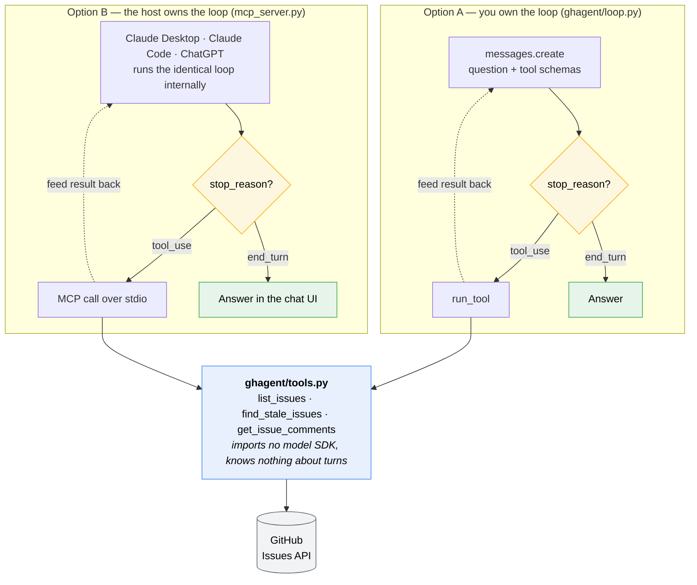
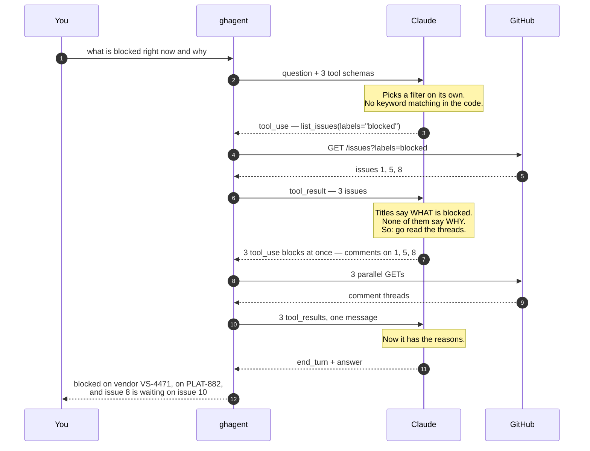

# gh-issue-agent

Ask a question about a GitHub backlog in plain English. Claude works out which GitHub API calls it needs, makes them, reads the results, and answers.

```
$ gh-agent "what's blocked right now and why"
```

This is a personal proof-of-concept. I wanted to understand how AI agents actually work by building the smallest honest example I could, rather than reading about them. The interesting part turned out to be about forty lines of Python.

---

## New to this? Start here

If you have used ChatGPT or Claude, you have used a language model that does exactly one thing: you send text, it sends text back. It cannot look anything up. If you ask about your GitHub issues, it can only guess, because it has never seen them.

**An agent is that same model, given the ability to act.** You hand it a short list of things it is allowed to do — here, three ways to read GitHub — and then you run a loop:

1. Send the model the question, plus a description of the tools available.
2. The model replies either *"here is my answer"* or *"call this tool with these arguments first."*
3. If it asked for a tool, you run it and send the result back.
4. Repeat until it has enough to answer.

That loop is the whole idea. The model never touches the internet itself; it asks your program to fetch things and reasons about what comes back.

**Why is that a big deal?** Because nobody writes the plan. There is no keyword matching in this repository — no `if "blocked" in question`, no routing table, no list of question types. The program's only job is to describe the three tools, run whatever gets requested, and pass results back. Deciding *which* tool, with *which* arguments, and *how many times*, is entirely the model's.

Ask *"what's blocked and why"* and it fetches the blocked issues, notices the titles don't explain the cause, and goes and reads the comment threads. Ask something else and it builds a different plan. Same code either way.

---

## What you actually see when you run it

The issues this reads live in this repository's own Issues tab. They are **made-up seed data** — a fictional billing-reconciliation service — so anyone can clone this and get the same answers without needing a real backlog.

```
$ gh-agent "what's blocked right now and why"

-> list_issues(labels="blocked")
<- 3 issues

-> get_issue_comments(issue_number=1)
-> get_issue_comments(issue_number=5)
-> get_issue_comments(issue_number=8)
<- 3 comment threads

Issue #1 is waiting on vendor ticket VS-4471. Issue #5 is blocked
on PLAT-882. Issue #8 is waiting on issue #10 to land first.
```

Look at what happened in the middle. The model asked for the blocked issues, got three back, and then decided on its own that titles alone couldn't answer a *why* question — so it issued three more calls, in parallel, to read the discussions. Nothing in the code told it to do that.

---

## The three tools

A "tool" here is just an ordinary Python function, plus a written description of what it does. The description is what the model sees.

| Tool | What it does | Returns |
|---|---|---|
| `list_issues(state, labels, assignee)` | Lists issues, optionally filtered | `count`, the `filters` applied, and `issues[]` — number, title, state, labels, assignee, comment count, timestamps, shortened body |
| `find_stale_issues(days, state, labels)` | Finds issues nobody has touched in N days | `as_of`, `threshold_days`, `count`, and `issues[]` with a computed `stale_days` each |
| `get_issue_comments(issue_number)` | Reads one issue's discussion | `issue_number`, `comment_count`, and `comments[]` — author, timestamp, body |

All three are plain functions calling the GitHub REST API. **None of them knows Claude exists.** That matters later.

`find_stale_issues` is the one worth pausing on. It isn't a new API endpoint — it calls `list_issues` and does the date arithmetic locally. It exists because *"what has gone stale"* has no label behind it. You cannot filter your way to that answer; something has to compute it. That is the clearest line between an agent and a search box.

**A note on the clock.** `_now()` reads an optional `AGENT_NOW` environment variable and otherwise returns real UTC time. Injecting the clock makes the date math testable without waiting around — and it doubles as a demo convenience, because every seed issue here was created within the same minute, so against the real clock they all have identical ages. Run with `AGENT_NOW=2026-11-01` to watch staleness ranking do something interesting.

---

## How the model decides which tool to call

The model never sees the Python. It sees only the JSON schemas in `TOOLS` — a name, a description, and a typed parameter list per tool. Those descriptions are the entire basis for its decision, which makes writing them closer to prompt engineering than to documentation. Three wording choices do most of the work:

- `list_issues` is described as the broad first step, and its return value is documented as including a **comment count**. That gives the model a cheap hint about whether a thread is worth fetching at all.
- `get_issue_comments` is described as the way to find out *why* — and explicitly as costing one API call per issue. That discourages fetching all twelve threads when three will do.
- `find_stale_issues` says outright that no staleness label exists, so the model knows filtering cannot substitute for it.

The seed data is arranged to make the decision visible. Issue #1 is labeled `blocked`, but its body never says what is blocking it — the answer ("vendor ticket VS-4471") lives only in the comments. So *"what's blocked right now and why"* genuinely cannot be answered from `list_issues` alone, and you can watch the model work that out.

Change the question and the plan changes. Asked *"anything gone stale we should re-check before the v2 shutoff?"*, it opens with `find_stale_issues`, pulls the threads that matter, and notices the Oct 15 escalation deadline buried in #5's comments has already passed relative to the staleness it just computed. Two tools and a date comparison, assembled by the model.

---

## How the loop works

There are two ways to run the same three tools. Either this repo owns the loop, or a host application like Claude Desktop owns it.



**Read the two boxes side by side: they are the same shape.** Both branch on `stop_reason` (the field where the API says whether the model is done or wants a tool), both feed the result back and ask again, both stop on `end_turn`. That dotted edge — result goes back in, model decides again — is what makes either one an agent rather than a single API call.

The only difference is *whose process the loop runs in*. Everything below the fork is shared byte for byte: one `ghagent/tools.py`, three functions, no model SDK imported anywhere in it. That separation isn't tidiness — it's the reason the same tools serve a command line and Claude Desktop without a rewrite.

Going from A to B, you hand the host your system prompt, model choice, turn budget, and trace. You gain distribution and delete about sixty lines. **MCP buys reach and costs control**, which is why both files are still here.

### A real run, turn by turn

This is an actual trace, not an illustration.



Step 7 is my favourite part: the model read a list, judged it insufficient, and issued three more calls *in parallel* to fill the gap. That decision exists nowhere in this repository.

Step by step, in `ask()`:

1. **Send.** Post the conversation to `POST /v1/messages` along with the tool schemas. Tools are just a parameter on the ordinary Messages endpoint — there is no separate "agent API."
2. **Branch on `stop_reason`.** `"tool_use"` means the response contains one or more tool requests and the model is waiting on you. `"end_turn"` means it is finished and the loop exits.
3. **Append the assistant turn verbatim.** `messages.append({"role": "assistant", "content": response.content})` — the whole content list, not just the text. The API is stateless: this list is the loop's only memory, and a dropped block breaks the next request.
4. **Execute.** Each request carries a `name`, an `input` dict, and an `id`. Dispatch through `TOOL_FUNCTIONS` and capture the output. Tool inputs arrive as parsed JSON — never string-match the serialized form.
5. **Return the results.** Each result is a `tool_result` block whose `tool_use_id` matches the call it answers. **All results from one assistant turn go back in a single user message.** Splitting them across several messages teaches the model to stop issuing parallel calls.
6. **Repeat.** The model now sees its own request and the real data, and decides whether it has enough.

Two details that matter more than they look:

- **A failed tool returns a result, not an exception.** `run_tool` catches everything and returns the error text with `is_error: True`. The model sees the failure and can retry with different arguments; an uncaught exception would just kill the loop.
- **Tool results are trimmed before they go back.** GitHub sends roughly eighty fields per issue. `list_issues` keeps nine and shortens the body to 600 characters. Every field you keep is re-sent on *every subsequent turn*, so trimming is a cost decision, not tidiness.

`max_turns` caps the loop at 10 iterations so a pathological plan cannot bill indefinitely.

---

## Setup

Requires Python 3.10+ and, optionally, the [GitHub CLI](https://cli.github.com/).

```bash
git clone https://github.com/michaeldinhmai/gh-issue-agent-demo.git
cd gh-issue-agent-demo
python -m venv .venv
.venv/Scripts/activate      # macOS/Linux: source .venv/bin/activate
pip install -e ".[dev,web]"
cp .env.example .env
```

Then fill in `.env`:

```
ANTHROPIC_API_KEY=sk-ant-...
GITHUB_TOKEN=                 # optional — falls back to `gh auth token`
GITHUB_REPO=michaeldinhmai/gh-issue-agent-demo
```

`ANTHROPIC_API_KEY` comes from [console.anthropic.com](https://console.anthropic.com/settings/keys). `GITHUB_TOKEN` only needs read access to issues; leave it blank and the agent borrows the token from an authenticated `gh` CLI, so no personal access token has to be written to disk. `.env` is gitignored.

## Running it

```bash
gh-agent "what's blocked right now and why"
gh-agent "summarize the open bugs"
gh-agent "what has nobody picked up yet"

# staleness needs a future clock - see the note above
AGENT_NOW=2026-11-01 gh-agent "what has gone stale and nobody is chasing?"
```

Each tool call prints as it happens — `-> tool(args)` for the request, `<- result` for the response — so you can watch the plan form instead of inferring it. Set `AGENT_VERBOSE=0` for just the answer.

---

## Using it from Claude Desktop, Claude Code, or ChatGPT

MCP (Model Context Protocol) is a standard way to expose tools to a chat application. `mcp_server.py` publishes the same three tools over it, so the host supplies the loop instead of this repo. It imports the tools and adds nothing else — no `anthropic` package, no API key, no message list, no `max_turns`.

Register it with Claude Code:

```bash
claude mcp add gh-issues -- /full/path/to/.venv/Scripts/python.exe /full/path/to/mcp_server.py
```

Or add it to `claude_desktop_config.json`:

```json
{
  "mcpServers": {
    "gh-issues": {
      "command": "C:\path\to\gh-issue-agent-demo\.venv\Scripts\python.exe",
      "args": ["C:\path\to\gh-issue-agent-demo\mcp_server.py"]
    }
  }
}
```

Then ask Claude *"what's blocked in my backlog and why"* in the chat window and watch it call `list_issues`, decide the titles aren't enough, and chain into `get_issue_comments` — the same plan the command line produces, with none of your code in the middle.

**The tool descriptions do the same job here.** MCP derives each tool's schema and description from the Python signature and docstring, so the wording that drives the decision is still yours. Still prompt engineering; only the transport changed.

**What you give up.** With your own loop you control the system prompt, the model, the turn cap, and you can record a trace — which is what makes `evals/` possible. Under MCP the host owns all of that. You can still log calls server-side, but then you are measuring someone else's harness driving your tools. That trade is why both files exist.

---

## The web UI

```bash
pip install -e ".[web]"
uvicorn web.app:app --port 8000
```

Then open <http://localhost:8000>.

**The trace is the point, not the answer.** A chat box that returns a paragraph looks like every other LLM demo and shows nothing about what is underneath. This page renders each tool call the moment the model issues it — name, arguments, result — so the plan assembles in front of you. On a typical run the first call lands about two seconds in, the parallel comment fetches around eight, the answer near twenty. The gap between *"it fetched a list"* and *"it decided that list wasn't enough"* is the whole thing worth watching.

It is deliberately small: one FastAPI file, one HTML file, no build step, no framework, no CDN.

**It contains no agent logic.** `ghagent.loop.run()` is a generator that yields one event per step, so the server just forwards those events as Server-Sent Events and the browser just renders them. The command line consumes the same generator and prints instead. Adding the UI required no change to the loop — the payoff of having refactored it to yield rather than print.

One detail worth knowing: `run()` is synchronous and blocks on the Anthropic API, so the server steps it in a worker thread via `run_in_executor`. Inline, it would stall the asyncio event loop, the response would flush all at once, and the page would show nothing until it showed everything — defeating the purpose.

The browser renders the small subset of markdown Claude actually emits (bold, italic, inline code, lists), with HTML escaped *before* any tag is inserted, so issue text cannot inject markup into the page.

---

## Testing

This project has two halves that fail in completely different ways, so it has two kinds of test.

```bash
pip install -e ".[dev]"
pytest                                   # 28 tests, no network, no API key
python evals/eval_routing.py --runs 3    # spends tokens, needs a live repo
```

**`tests/` — the predictable half.** Everything except the model's judgement is ordinary code and tests like ordinary code. `tests/test_tools.py` covers the trimming (does it drop pull requests, shorten the body, survive a missing assignee), the filter forwarding, and the staleness arithmetic — inclusive threshold, no rounding up a partial day, no mixing naive and timezone-aware datetimes.

`tests/test_loop.py` is the more valuable file, because the loop's contract with the API is the thing that breaks silently:

- all `tool_result` blocks from one assistant turn land in a **single** user message
- every `tool_use_id` matches the call it answers
- the assistant turn is appended **whole**, thinking blocks included
- a raising tool becomes an error result, not a crash
- `max_turns` actually caps the loop

Break any of those and the API still returns 200. The model just quietly gets worse — no exception, no failed request, nothing in the logs. That is exactly the failure worth a test.

I checked those tests against deliberate breakage rather than assuming they worked: dropping non-text blocks from the assistant turn, splitting tool results across separate user messages, and re-adding `strict: True` to an all-optional schema each produce a failure. The last is a rule rather than a single case — `test_no_all_optional_schema_declares_strict` walks every tool definition, so a fourth tool added later inherits the guard.

**`evals/` — the unpredictable half.** Whether the model picks the right tool is not unit-testable. It is a probabilistic decision, and the thing most likely to break it is a *reworded tool description* — a change no unit test would notice, because no code changed.

So the evals assert on the **trace**, never on the prose: given *"what's blocked right now and why"*, did `get_issue_comments` get called at all? (If not, the model answered a *why* question without reading any discussion — meaning it invented the reason.) Given a staleness question, did it route to `find_stale_issues`? Did any call come back malformed? Prose assertions would fail on rewrites that are equally correct; trace assertions catch real regressions.

Run with `--runs N` and read the pass rate, not a single result. One failure on a stochastic system is a reason to look, not proof of a regression.

**What neither would have caught.** The `strict: True` bug described below produced malformed tool *arguments* — valid JSON, valid against the schema, semantically garbage. No unit test would have seen it, because no Python behaved incorrectly. Only running it against a real API surfaced it. That's the honest limitation: for an agent, integration and behavioural runs aren't an optional layer on top of unit tests — they're where a whole category of bug lives.

---

## Notes and things I learned

**Hand-written loop, not the SDK's tool runner.** The Anthropic Python SDK ships `client.beta.messages.tool_runner`, which drives this loop for you from decorated functions. It is the right choice for production. I wrote the loop out by hand because the loop is the thing I wanted to understand — and a hand-written one avoids the beta dependency and leaves room for per-turn control (approval gates, budget tracking, logging) that the runner only exposes through hooks.

**Model.** `claude-opus-5`. Thinking is on by default on this model, so it plans before committing to a call. Those thinking blocks come back in `response.content` and are echoed to the API unchanged — which is why the assistant turn has to be appended whole.

**`strict: True` on `get_issue_comments` only — and that asymmetry was earned.** Strict schema validation guarantees the `input` dict matches the schema, so `TOOL_FUNCTIONS[name](**tool_input)` can't blow up on an unexpected keyword. I originally set it on both tools. With it on `list_issues` — which has three *optional* parameters and `required: []` — roughly a third of calls came back with a corrupted `assignee`: the model wanted `list_issues(labels="bug", state="open")`, had no use for `assignee`, and emitted fragments of its own tool-call markup into that string instead of omitting the field. GitHub answered 422.

Strict validation can't catch that, because the garbage *is* a valid string. Dropping strict from `list_issues` — where every parameter is optional and the model needs freedom to omit fields — eliminated it. `get_issue_comments` has one required parameter and never showed the problem, so it keeps strict. Rule of thumb: strict pairs well with required parameters and badly with a bag of optional ones.

Worth noting how the loop behaved while the bug was live: the 422 came back as a `tool_result` with `is_error: True`, the model read the failure, retried with different arguments, and still produced a correct answer. Slower and more expensive, but it did not fail. That is the practical argument for returning tool errors as results instead of raising.

**Every tool returns an envelope, never a bare list.** `get_issue_comments` returns `{"issue_number": 10, "comment_count": 0, "comments": []}` rather than `[]`. The reason is specific to the reader being a model: a bare empty list cannot distinguish *"this issue has no discussion"* from *"the call failed and returned nothing."* One is a fact worth reporting; the other deserves a retry. Restating the query alongside a count makes absence explicit and quotable, so the model stops guessing.

This surfaced by running the tools through MCP, where an empty thread rendered as `completed with no output` — indistinguishable from a broken tool. `find_stale_issues` carries the idea further with an `as_of` field: without it, `stale_days: 0` could mean an active repo *or* a wrong clock, and the model has no way to tell which. Designing the *shape* of a result for a model to read turns out to be a distinct skill from designing a REST response for a program.

**Read-only by design.** None of the tools write. An agent that can close issues is a different risk conversation, and not one this project needs to have.

---

## Files

| File | Purpose |
|---|---|
| `ghagent/tools.py` | The three tools and their schemas. No model SDK, no loop |
| `ghagent/loop.py` | The tool-use loop, as a generator yielding one event per step |
| `ghagent/config.py` | Credentials, target repo, and the injectable clock |
| `ghagent/cli.py` | Terminal entry point — renders loop events as they arrive |
| `mcp_server.py` | The same tools over MCP, for a host that brings its own loop |
| `web/app.py` | FastAPI server streaming those same events over SSE |
| `web/static/index.html` | The single-page UI. No build step, no dependencies |
| `tests/test_tools.py` | Trimming, filtering, and staleness arithmetic |
| `tests/test_loop.py` | The loop's message protocol, against a fake client |
| `evals/eval_routing.py` | Trace-based checks on the model's tool selection |
| `pyproject.toml` | Dependencies, the `gh-agent` script, and pytest config |
| `.env.example` | Template for credentials |
